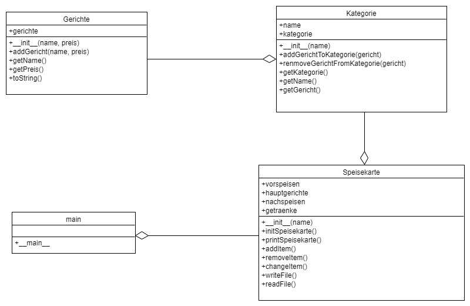

# Menu-Manager

## Übersicht
Der **Menu-Manager** ist eine Python-Anwendung zur Verwaltung von Speisekarten. Mit diesem Programm kannst du verschiedene Kategorien wie Vorspeisen, Hauptgerichte, Nachspeisen und Getränke verwalten, Gerichte hinzufügen, entfernen oder ändern sowie Speisekarten in einer Textdatei speichern und laden. Die Anwendung basiert auf **Objektorientierter Programmierung (OOP)** und nutzt verschiedene Klassen, um das Menü zu organisieren und zu bearbeiten.

## Funktionen
- **Speisekarte anzeigen**: Zeigt das gesamte Menü an, einschließlich aller Kategorien und der darin enthaltenen Gerichte.
- **Neues Gericht hinzufügen**: Fügt ein neues Gericht zu einer ausgewählten Kategorie hinzu.
- **Gericht löschen**: Löscht ein Gericht aus einer Kategorie.
- **Kategorie ändern**: Verschiebt ein Gericht von einer Kategorie in eine andere.
- **Speisekarte speichern**: Speichert die Speisekarte in einer Textdatei.
- **Speisekarte laden**: Lädt eine zuvor gespeicherte Speisekarte aus einer Textdatei.

## UML



## Verzeichnisstruktur
Die Anwendung ist in mehrere Module unterteilt, die in einem klar strukturierten Verzeichnisbaum organisiert sind:

```
Menu-Manager/
│
├── src/
│   ├── Category.py    # Definiert die Kategorie-Klasse
│   ├── Food.py        # Definiert die Food-Klasse
│   ├── Menu.py        # Definiert die Menu-Klasse
├── main.py            # Der Einstiegspunkt der Anwendung
```

- **Category.py**: Enthält die `Category`-Klasse, die eine Menü-Kategorie darstellt und Methoden zum Hinzufügen und Entfernen von Gerichten bietet.
- **Food.py**: Enthält die `Food`-Klasse, die ein Gericht beschreibt (mit Name und Preis).
- **Menu.py**: Die `Menu`-Klasse verwaltet das Menü und bietet Funktionen zum Anzeigen, Bearbeiten und Speichern der Speisekarte.
- **main.py**: Startpunkt der Anwendung, der den Benutzer durch ein Textmenü führt, um mit der Speisekartenverwaltung zu interagieren.

## Installation

1. Klone das Repository oder lade den Code herunter:
   ```bash
   git clone https://github.com/MauriceLe/Menu-Manager.git
   ```

2. Stelle sicher, dass Python 3.x installiert ist. Überprüfe dies mit:
   ```bash
   python --version
   ```

3. Navigiere zum Verzeichnis des Projekts:
   ```bash
   cd Menu-Manager
   ```

4. Installiere alle erforderlichen Abhängigkeiten (falls zutreffend).

## Nutzung

### Programm starten
Um das Programm zu starten, führe einfach `main.py` aus:

```bash
python main.py
```

### Menüoptionen
Sobald das Programm gestartet ist, wird dem Benutzer ein Menü angeboten:

```
a = Speisekarte anzeigen 
n = Neues Gericht hinzufügen 
e = Programm beenden 
l = Gericht löschen 
k = Kategorie ändern
```

- **Speisekarte anzeigen** (`a`): Zeigt alle Kategorien und deren Gerichte an.
- **Neues Gericht hinzufügen** (`n`): Füge ein neues Gericht zu einer Kategorie hinzu. Du wirst nach der Kategorie, dem Namen des Gerichts und dem Preis gefragt.
- **Gericht löschen** (`l`): Lösche ein Gericht aus einer Kategorie. Du wirst nach der Kategorie und dem Gericht gefragt, das du entfernen möchtest.
- **Kategorie ändern** (`k`): Verschiebe ein Gericht von einer Kategorie in eine andere.
- **Programm beenden** (`e`): Beendet das Programm und speichert die Änderungen in einer Datei.

### Beispiel für die Nutzung

```bash
$ python main.py

a = Speisekarte anzeigen 
n = Neues Gericht hinzufügen 
e = Programm beenden 
l = Gericht löschen 
k = Kategorie ändern 

Auswahl tätigen: a

0. - Vorspeisen -
Bruschetta: 5.0
1. - Hauptgerichte -
Spaghetti Carbonara: 12.5
2. - Nachspeisen -
Tiramisu: 6.0
3. - Getraenke -
Wasser: 2.0

Auswahl tätigen: n

Kategorie: 0
Name: Caprese
Preis: 7.0

Speisekarte wurde aktualisiert.
```

### Speisekarten speichern und laden

- **Speisekarte speichern**: Am Ende jeder Sitzung kannst du das Menü unter einem benutzerdefinierten Namen speichern oder die Standarddatei `Speisekarte.txt` verwenden.
- **Speisekarte laden**: Beim Starten des Programms wird automatisch die Datei `Speisekarte.txt` geladen, falls sie existiert.
